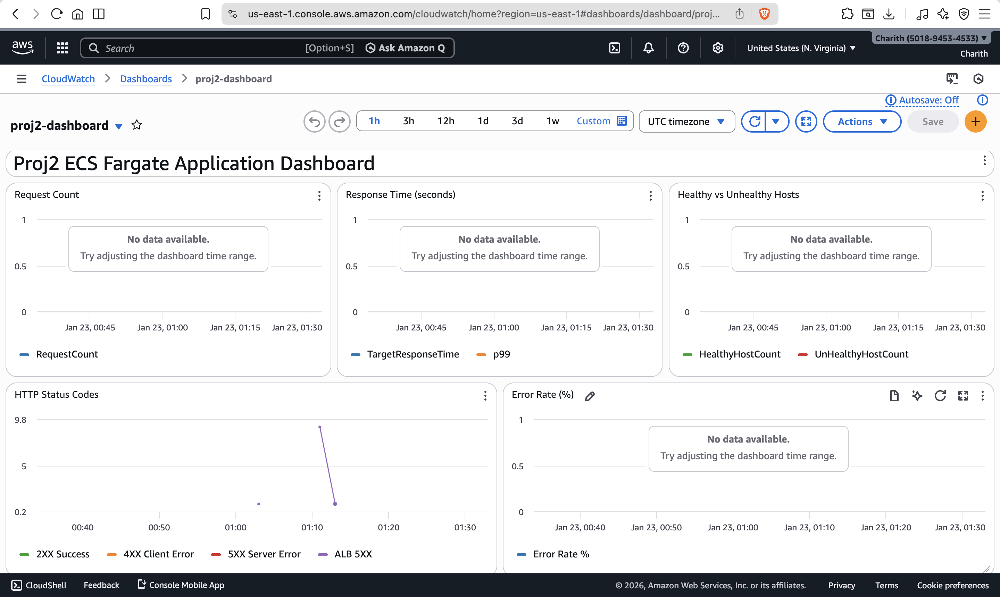
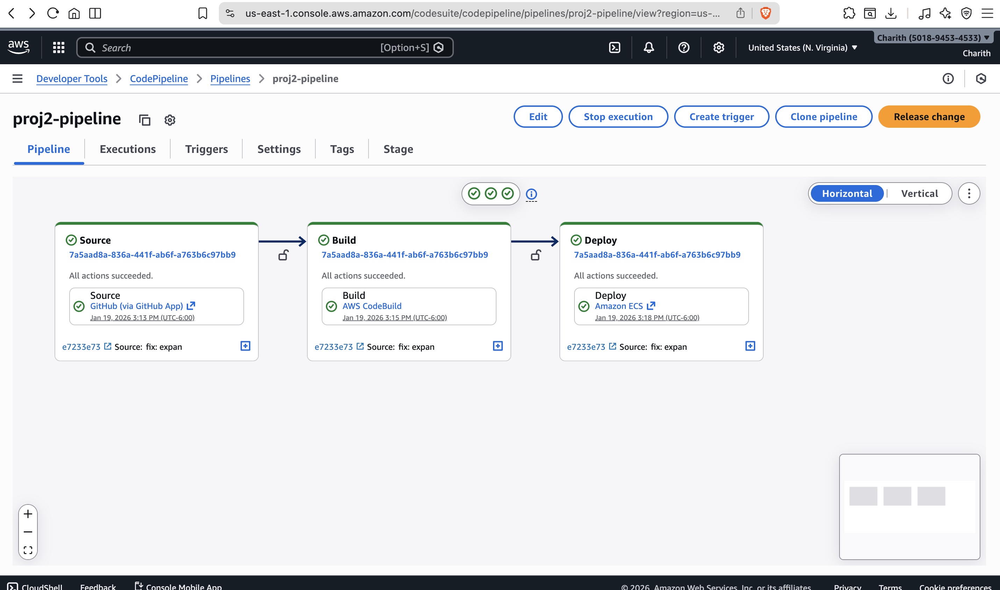
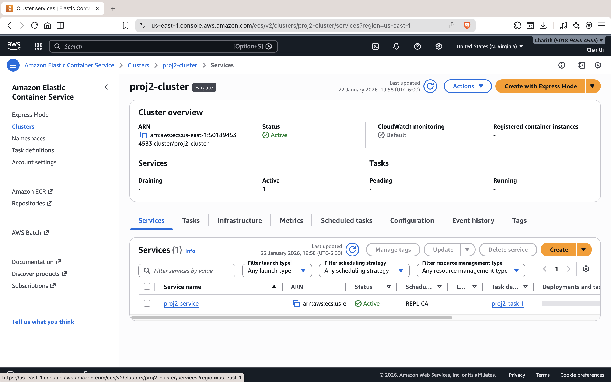
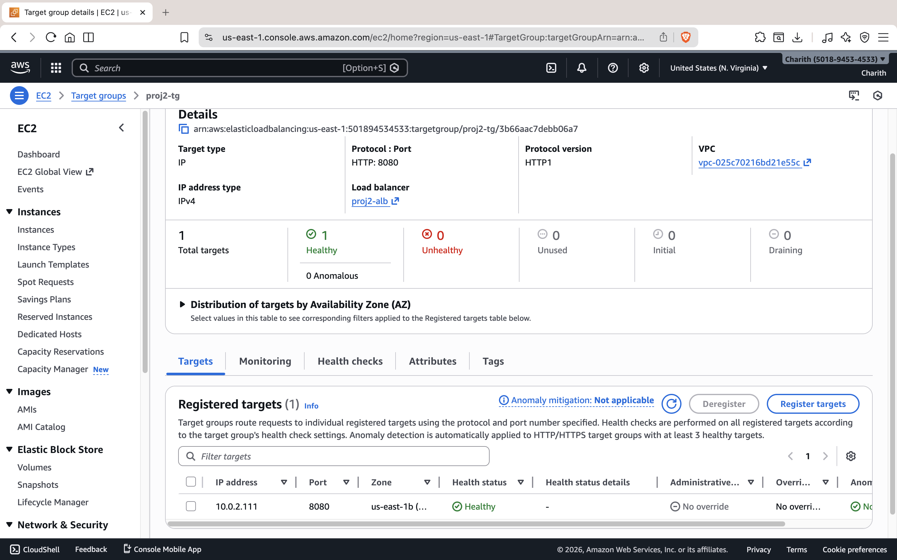
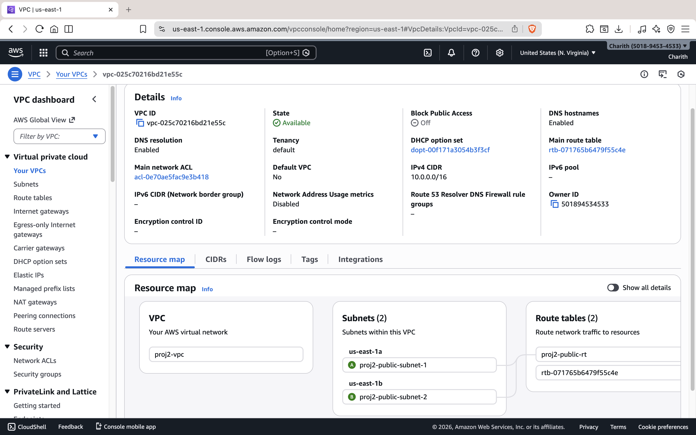
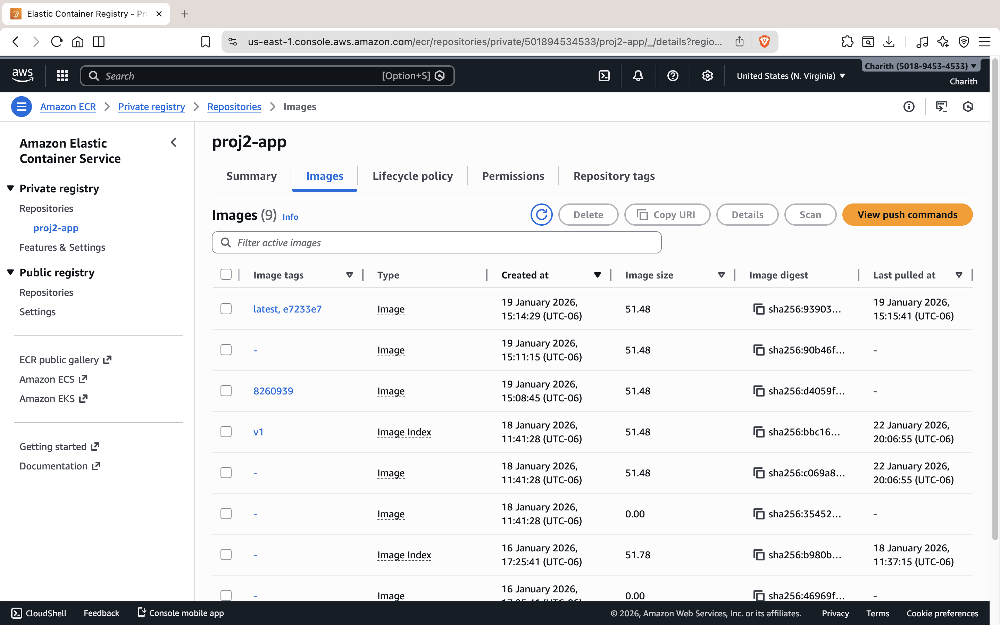
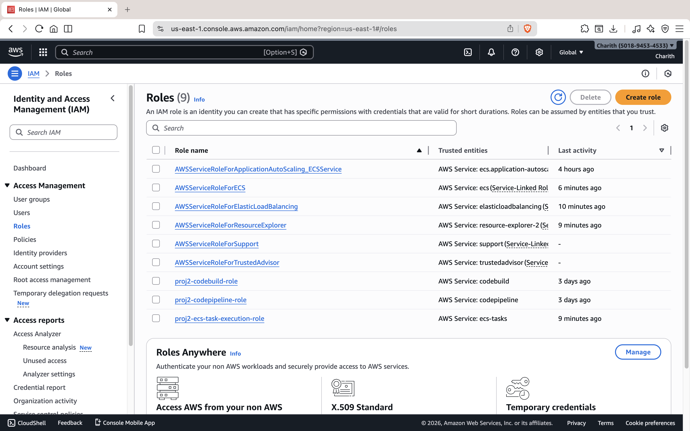
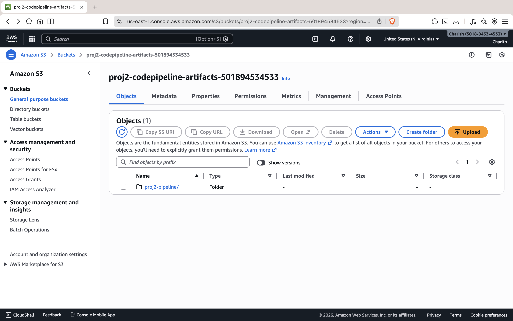

# ECS Fargate Infrastructure

A production-ready containerized application running on AWS ECS Fargate with full CI/CD, monitoring, and cost-optimized auto-scaling.

**Live Demo:** http://proj2-alb-830302272.us-east-1.elb.amazonaws.com/

**Project Write-up:** https://charithkapuluru.com/projects/terraform-ecs-deployment/

## What This Is

This project deploys a Flask API to AWS using:
- **ECS Fargate** - Serverless containers (no EC2 management)
- **Application Load Balancer** - Traffic distribution and health checks
- **CodePipeline** - Automated deployments from GitHub
- **CloudWatch** - Monitoring, alarms, and dashboards
- **Fargate Spot** - Up to 70% cost savings on compute

Everything is defined as Infrastructure as Code using Terraform.

## Architecture

```
                                    ┌─────────────────────────────────────────────────┐
                                    │                    AWS Cloud                     │
                                    │                                                  │
┌──────────┐    ┌──────────┐       │   ┌─────────┐      ┌─────────────────────────┐  │
│  GitHub  │───▶│CodePipeline│──────┼──▶│   ECR   │      │        VPC              │  │
└──────────┘    └──────────┘       │   └────┬────┘      │  ┌───────────────────┐  │  │
                     │             │        │           │  │   Public Subnets  │  │  │
                     ▼             │        ▼           │  │                   │  │  │
               ┌──────────┐       │   ┌─────────┐      │  │  ┌─────┐ ┌─────┐  │  │  │
               │CodeBuild │       │   │   ALB   │◀─────┼──┼──│Task │ │Task │  │  │  │
               │(Docker)  │       │   └────┬────┘      │  │  └─────┘ └─────┘  │  │  │
               └──────────┘       │        │           │  │    ECS Fargate    │  │  │
                                    │        ▼           │  └───────────────────┘  │  │
     ┌──────────┐                  │   ┌─────────┐      └─────────────────────────┘  │
     │ Internet │─────────────────┼──▶│  :80    │                                    │
     └──────────┘                  │   └─────────┘                                    │
                                    │                                                  │
                                    │   ┌─────────────┐    ┌───────────┐              │
                                    │   │ CloudWatch  │    │    SNS    │              │
                                    │   │ (Logs/Alarms)│───▶│  (Email)  │              │
                                    │   └─────────────┘    └───────────┘              │
                                    └─────────────────────────────────────────────────┘
```

## Screenshots

### CloudWatch Dashboard


### CI/CD Pipeline (CodePipeline)


### ECS Service


### ALB Health Check


### VPC Networking


### ECR Repository


### IAM Roles


### S3 Pipeline Artifacts


## Demo Video

[Watch the 2-minute demo](https://youtu.be/BFJp-hrPYKg) showing:
- Live app responding to requests
- CodePipeline Source → Build → Deploy flow
- ECS Fargate running tasks
- CloudWatch dashboard with metrics and alarms

## Skills Demonstrated

What I learned and applied in this project:

| Category | Skills |
|----------|--------|
| **Infrastructure as Code** | Terraform modules, state management, variables, outputs |
| **AWS Compute** | ECS Fargate, task definitions, container orchestration |
| **AWS Networking** | VPC, subnets, security groups, Application Load Balancer |
| **CI/CD** | CodePipeline, CodeBuild, ECR, automated deployments |
| **Monitoring & Observability** | CloudWatch logs, metrics, alarms, dashboards |
| **Cost Optimization** | Fargate Spot (70% savings), scheduled scaling |
| **Containerization** | Docker, ECR, multi-stage builds |
| **Security** | IAM roles, security groups, least-privilege access |

## Project Structure

```
.
├── app/
│   ├── app.py              # Flask application
│   ├── Dockerfile          # Container definition
│   └── requirements.txt    # Python dependencies
├── terraform/
│   ├── main.tf             # Provider config
│   ├── vpc.tf              # VPC, subnets, routing
│   ├── security.tf         # Security groups
│   ├── alb.tf              # Load balancer
│   ├── ecs.tf              # ECS cluster, task def, service
│   ├── iam.tf              # IAM roles
│   ├── cloudwatch.tf       # Log groups
│   ├── sns.tf              # Alert notifications
│   ├── alarms.tf           # CloudWatch alarms
│   ├── dashboard.tf        # CloudWatch dashboard
│   ├── codepipeline.tf     # CI/CD pipeline
│   ├── autoscaling.tf      # Auto-scaling policies
│   ├── variables.tf        # Input variables
│   └── outputs.tf          # Output values
├── buildspec.yml               # CodeBuild instructions
├── website-content/            # Phase documentation files
│   └── phase-*-explanation.txt # Detailed docs for each phase
└── docs/
    └── screenshots/            # AWS Console screenshots
```

## Prerequisites

- AWS CLI configured with appropriate credentials
- Terraform >= 1.5.0
- Docker (for local testing)
- GitHub account (for CI/CD)

## Deployment

### First Time Setup

1. **Clone and configure**
   ```bash
   git clone https://github.com/CharithKapuluru/proj2-ecs-fargate.git
   cd proj2-ecs-fargate/terraform
   ```

2. **Update variables** (optional)

   Edit `variables.tf` or create a `terraform.tfvars`:
   ```hcl
   aws_region      = "us-east-1"
   alert_email     = "your-email@example.com"
   github_repository = "YourUsername/proj2-ecs-fargate"
   ```

3. **Deploy infrastructure**
   ```bash
   terraform init
   terraform plan
   terraform apply
   ```

4. **Authorize GitHub connection**

   After `terraform apply`, go to the AWS Console:
   - Navigate to CodePipeline → Settings → Connections
   - Find `proj2-github-connection` and click "Update pending connection"
   - Authorize with your GitHub account

5. **Push to trigger deployment**
   ```bash
   git push origin main
   ```

The pipeline will automatically build, push to ECR, and deploy to ECS.

## CI/CD Pipeline

Every push to `main` triggers:

1. **Source** - CodePipeline pulls code from GitHub
2. **Build** - CodeBuild builds Docker image, pushes to ECR
3. **Deploy** - ECS service updates with new image (rolling deployment)

The whole process takes about 5-7 minutes.

### Manual Deployment

If you need to deploy without pushing to GitHub:
```bash
# Build and push image manually
cd app
aws ecr get-login-password --region us-east-1 | docker login --username AWS --password-stdin <account-id>.dkr.ecr.us-east-1.amazonaws.com
docker build -t proj2-app .
docker tag proj2-app:latest <account-id>.dkr.ecr.us-east-1.amazonaws.com/proj2-app:latest
docker push <account-id>.dkr.ecr.us-east-1.amazonaws.com/proj2-app:latest

# Force new deployment
aws ecs update-service --cluster proj2-cluster --service proj2-service --force-new-deployment
```

## Monitoring

### CloudWatch Dashboard

Access the dashboard at:
```
https://us-east-1.console.aws.amazon.com/cloudwatch/home?region=us-east-1#dashboards:name=proj2-dashboard
```

Tracks:
- Request count and latency
- HTTP 4xx/5xx errors
- CPU and memory utilization
- Running task count
- Healthy host count

### Alarms

The following alarms send email notifications:
- High CPU (> 80%)
- High Memory (> 80%)
- High error rate (5xx > 10/min)
- Unhealthy targets
- Service task count drops to 0 (unexpected)

### Logs

View container logs:
```bash
aws logs tail /ecs/proj2-app --follow
```

Or in the console: CloudWatch → Log groups → `/ecs/proj2-app`

## Auto-Scaling

### Dynamic Scaling

The service scales based on:
- **CPU utilization** - Target: 70%
- **Request count** - Target: 100 requests/target/minute

Scale-out happens quickly (60s cooldown), scale-in is slower (300s cooldown) to avoid flapping.

### Scheduled Scaling

To save costs, the service scales to zero at night:
- **10 PM UTC** - Scale to 0 tasks
- **8 AM UTC** - Scale back to 1-4 tasks

Modify the schedule in `autoscaling.tf` if needed.

### Fargate Spot

80% of tasks run on Fargate Spot (up to 70% cheaper than regular Fargate). At least 1 task always runs on regular Fargate for reliability during Spot interruptions.

## Cost Breakdown

Estimated monthly costs (us-east-1, minimal usage):

| Resource | Cost |
|----------|------|
| ALB | ~$16 |
| Fargate (1 task, 12 hrs/day, Spot) | ~$3 |
| ECR | < $1 |
| CloudWatch | < $1 |
| NAT Gateway | $0 (not used) |
| **Total** | **~$20/month** |

The scheduled scaling + Fargate Spot saves roughly 83% compared to running regular Fargate 24/7.

## API Endpoints

| Endpoint | Description |
|----------|-------------|
| `GET /` | Returns service info |
| `GET /health` | Health check (used by ALB) |

Example:
```bash
curl http://proj2-alb-830302272.us-east-1.elb.amazonaws.com/
# {"message":"Hello from ECS Fargate!","service":"proj2-app"}
```

## Useful Commands

```bash
# Check ECS service status
aws ecs describe-services --cluster proj2-cluster --services proj2-service

# View running tasks
aws ecs list-tasks --cluster proj2-cluster --service-name proj2-service

# Check pipeline status
aws codepipeline get-pipeline-state --name proj2-pipeline

# View recent alarms
aws cloudwatch describe-alarms --alarm-name-prefix proj2

# Force scale to specific count (temporarily)
aws application-autoscaling register-scalable-target \
  --service-namespace ecs \
  --resource-id service/proj2-cluster/proj2-service \
  --scalable-dimension ecs:service:DesiredCount \
  --min-capacity 2 --max-capacity 4
```

## Cleanup

To destroy all resources:
```bash
cd terraform
terraform destroy
```

Note: You'll need to manually delete:
- ECR images (if any exist)
- S3 bucket contents (codepipeline artifacts)
- CloudWatch log groups (if you want to remove logs)

## Documentation

Each phase of this project has detailed documentation:
- `website-content/phase-a-explanation.txt` - AWS basics and project setup
- `website-content/phase-b-explanation.txt` - VPC and networking
- `website-content/phase-c-explanation.txt` - Security groups and ALB
- `website-content/phase-d-explanation.txt` - ECR and Docker
- `website-content/phase-e-explanation.txt` - ECS Fargate deployment
- `website-content/phase-f-explanation.txt` - Monitoring and alerting
- `website-content/phase-g-explanation.txt` - CI/CD with CodePipeline
- `website-content/phase-h-explanation.txt` - Auto-scaling and cost optimization

## Tech Stack

- **Application:** Python 3.11, Flask, Gunicorn
- **Infrastructure:** Terraform, AWS (ECS, ECR, ALB, VPC, CloudWatch, CodePipeline)
- **Container:** Docker, AWS Public ECR base images

---

Built as a learning project to understand AWS container orchestration, IaC, and production deployment patterns.
